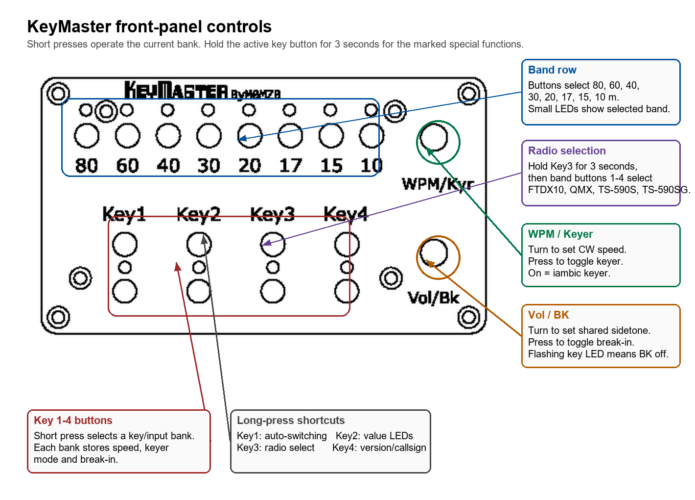
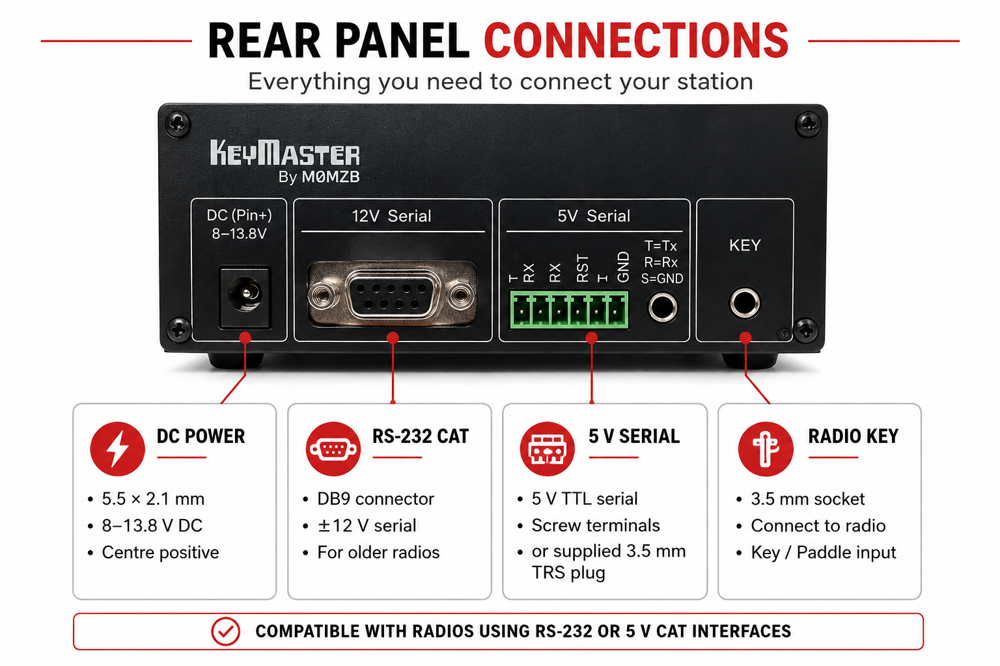

# KeyMaster


KeyMaster is a front-panel controller for sharing one radio between four CW key inputs. Each key input has its own saved operating bank, so changing from one key to another can also change CW speed, keyer mode, break-in mode, and band. Sidetone/monitor volume is shared across all banks.

The unit can run standalone with no radio connected. When a supported radio is connected by CAT, KeyMaster sends the front-panel changes to the radio and reads back the status values that the selected radio driver supports.

Firmware version: `02`

## Front Panel



## Rear Panel



## Quick Start

1. Power the KeyMaster and radio.
2. Select the required radio type if this is the first use with that radio.
3. Press `Key1`, `Key2`, `Key3`, or `Key4` to choose the active key/input bank.
4. Press a band button to select `80`, `60`, `40`, `30`, `20`, `17`, `15`, or `10` metres.
5. Turn `WPM/Kyr` to set CW speed.
6. Press `WPM/Kyr` to toggle the internal radio keyer mode.
7. Turn `Vol/Bk` to set sidetone/monitor volume.
8. Press `Vol/Bk` to toggle break-in.

Settings are saved automatically, but not instantly. Leave the unit powered for at least 30 seconds after changing settings if you want to be certain the latest changes have been written.

## What Each Bank Stores

Each of the four key/input banks stores:

| Setting | Meaning |
| --- | --- |
| CW speed | The WPM value sent to the radio |
| Keyer mode | Keyer on means iambic/electronic keyer; keyer off means straight-key style operation where supported |
| Break-in | Whether the radio transmits automatically while keying |

Monitor volume is stored once for the whole unit, not separately for each bank. When you select a different key bank, KeyMaster disconnects the key line briefly, applies the shared monitor volume plus the selected bank settings over CAT where possible, then reconnects the selected key input. If no radio is connected, the bank still changes locally.

## Normal Controls

### Key Buttons

| Action | Result |
| --- | --- |
| Short press `Key1` to `Key4` | Select that key/input bank |
| Hold the currently selected `Key1` for 3 seconds | Toggle automatic key-based input switching |
| Hold the currently selected `Key2` for 3 seconds | Toggle encoder-value display on the LEDs |
| Hold the currently selected `Key3` for 3 seconds | Enter or leave radio-selection mode |
| Hold the currently selected `Key4` for 3 seconds | Display firmware version, then send callsign `M0MZB` on the LEDs in Morse |

The active key LED blinks after about one second of holding as a warning that the three-second action is about to trigger.

### Band Buttons

The eight band buttons select:

```text
80  60  40  30  20  17  15  10
```

The small LEDs above the band row show the selected band. Some temporary displays reuse the band LEDs for short animations, then return to the selected band display.

### WPM/Kyr Control

| Action | Result |
| --- | --- |
| Turn `WPM/Kyr` | Change CW speed for the active bank |
| Press `WPM/Kyr` | Toggle keyer mode for the active bank |

When encoder-value display is enabled, changing WPM briefly shows the value on the LEDs before the display returns to normal.

Keyer feedback on the band LEDs:

| Keyer state | LED feedback |
| --- | --- |
| On | Outer three LEDs on each side illuminate briefly |
| Off | Four centre LEDs illuminate briefly |

### Vol/Bk Control

| Action | Result |
| --- | --- |
| Turn `Vol/Bk` | Change the shared monitor/sidetone volume |
| Press `Vol/Bk` | Toggle break-in for the active bank |

When encoder-value display is enabled, changing volume briefly shows the value on the LEDs before the display returns to normal.

Break-in feedback:

| Break-in state | LED feedback |
| --- | --- |
| On | Band LEDs fan out from the centre |
| Off | Band LEDs collapse back towards the centre |

When break-in is off, the active key LED flashes with a short off period. When break-in is on, the active key LED stays solid.

## Selecting The Radio Type

1. Short press `Key3` so bank 3 is the active bank.
2. Hold `Key3` for 3 seconds to enter radio-selection mode.
3. All band LEDs illuminate. The LED for the current radio flashes.
4. Press one of the band buttons below.
5. Hold `Key3` again for 3 seconds to leave radio-selection mode.

| Band button | Radio driver |
| ---: | --- |
| `80` / button 1 | Yaesu FTDX10 |
| `60` / button 2 | QRP Labs QMX |
| `40` / button 3 | Kenwood TS-590S |
| `30` / button 4 | Kenwood TS-590SG |
| `20` / button 5 | Yaesu FT-710 |
| `17` / button 6 | Kenwood TS-890S |

The radio choice is saved to EEPROM on the next scheduled settings write.

## Supported Radios

| Radio | CAT rate | Implemented status/control |
| --- | ---: | --- |
| Yaesu FTDX10 | 38400 baud | Band, CW speed, keyer, monitor volume, break-in |
| Yaesu FT-710 | 38400 baud | Band, CW speed, keyer, monitor volume, break-in |
| QRP Labs QMX | 9600 baud | Band and CW speed status; band, CW speed, keyer, monitor volume, and practice/break-in control |
| Kenwood TS-590S | 9600 baud | Band, CW speed, keyer, and monitor status; band, CW speed, keyer, monitor, and break-in control |
| Kenwood TS-590SG | 9600 baud | Band, CW speed, keyer, and monitor status; band, CW speed, keyer, monitor, and break-in control |
| Kenwood TS-890S | 9600 baud | Band, CW speed, keyer, monitor, and break-in status/control |

FT818 and IC7300 identifiers exist in the source but do not yet have drivers. Selecting an unsupported type falls back to the FTDX10 driver.

## LED Messages

| Display | Meaning |
| --- | --- |
| One key LED solid | Active key/input bank |
| Active key LED flashing | Break-in is off for the active bank |
| One band LED solid | Active band |
| All band LEDs on, one flashing | Radio-selection mode |
| Band LEDs show a temporary bar graph | Encoder-value display for WPM or volume |
| Every other band LED and every key LED lit briefly | CAT command queue overflow warning |
| Key LEDs flashing during a button hold | Long-press warning |

The overflow warning means the firmware could not queue a CAT command at that moment. The unit continues running; if the radio is disconnected or not responding, KeyMaster should still operate as a standalone key/input controller.

## Default Settings

On blank or invalid EEPROM, KeyMaster starts on input 1 with automatic key switching enabled, encoder-value display disabled, shared monitor volume `10`, and the FTDX10 driver selected.

| Bank | CW speed | Keyer | Break-in |
| ---: | ---: | --- | --- |
| 1 | 25 | On | Off |
| 2 | 35 | On | Off |
| 3 | 25 | Off | Off |
| 4 | 35 | Off | Off |

## Troubleshooting

| Symptom | Things to check |
| --- | --- |
| Radio does not respond to controls | Confirm the selected radio type, CAT cable, radio CAT baud rate, and that the radio is powered |
| KeyMaster works until the radio is unplugged | This should not happen in current firmware; if it does, note the LED pattern and selected radio type |
| Active key LED keeps flashing | Break-in is off for that bank; press `Vol/Bk` to toggle it |
| The wrong key bank is selected when keying | Check whether automatic key-based input switching is enabled |
| A long press does nothing | Make sure you are holding the currently selected key button, not an inactive bank button |
| Latest setting was lost after power-off | Leave the unit powered for 30 seconds after changing settings |
| Uploading firmware fails | Disconnect or isolate the radio CAT interface while programming |

## Build And Upload

These notes are for firmware maintenance rather than day-to-day operation.

1. Open `_KeyMaster.ino` in Arduino IDE.
2. Select the board/core matching the ATmega328P hardware and the correct serial port.
3. Compile and upload.

The project uses only Arduino AVR core facilities and its bundled `EEPROM` library; there are no third-party library dependencies. The CAT port is the hardware `Serial` port, so radio CAT hardware can interfere with programming if it is connected during upload.

## Generate Code Documentation

The source includes Doxygen comments and a `Doxyfile`. To generate HTML documentation, install Doxygen and run:

```text
doxygen Doxyfile
```

The generated site is written to `docs/doxygen/html/index.html`. The generated output is not intended to be committed to the repository.

On GitHub, the `Doxygen Pages` workflow builds the same documentation and publishes it with GitHub Pages. If Pages is enabled for this repository using the GitHub Actions source, the hosted documentation will appear at:

```text
https://mad-bee.github.io/keyMaster/
```

## Hardware Pin Map

| Function | Arduino pin |
| --- | --- |
| Input-button resistor ladder | A0 |
| Band-button resistor ladder | A2 |
| Encoder push-button ladder | A4 |
| Multiplexer address A0 / A1 | D5 / D6 |
| Multiplexer enable | A5, LOW means connected |
| Shift-register data / clock / latch | D7 / D4 / A1 |
| Monitor encoder A / B | D3 / D2 |
| CW-speed encoder A / B | D8 / D9 |
| Key sense 1-4 | D13 / D12 / D11 / D10 |
| Radio CAT | Hardware `Serial` |

ADC thresholds are tied to the resistor values used by the control board. See [docs/ARCHITECTURE.md](docs/ARCHITECTURE.md) for thresholds, data flow, persistence, and driver details.

## Source Layout

| File | Purpose |
| --- | --- |
| `_KeyMaster.ino` | Hardware setup, user interface, bank switching, LEDs, EEPROM, and scheduler |
| `Radio.h/.cpp` | Common radio interface and status-change tracking |
| `FTDX10Radio.h/.cpp` | Yaesu CAT driver |
| `FT710Radio.h/.cpp` | Yaesu FT-710 CAT driver |
| `QMXRadio.h/.cpp` | QMX CAT/menu driver |
| `TS590SRadio.h/.cpp` | Kenwood TS-590S CAT driver |
| `TS590SGRadio.h/.cpp` | Kenwood TS-590SG CAT driver |
| `TS890SRadio.h/.cpp` | Kenwood TS-890S CAT driver |

## Known Limitations
- TS890S has no band stack register for 60m, so KeyMaster loads a typical CW frequency
- QMX status polling reports only frequency/band and CW speed; changes made on the QMX to keyer, monitor, or break-in are not read back.
