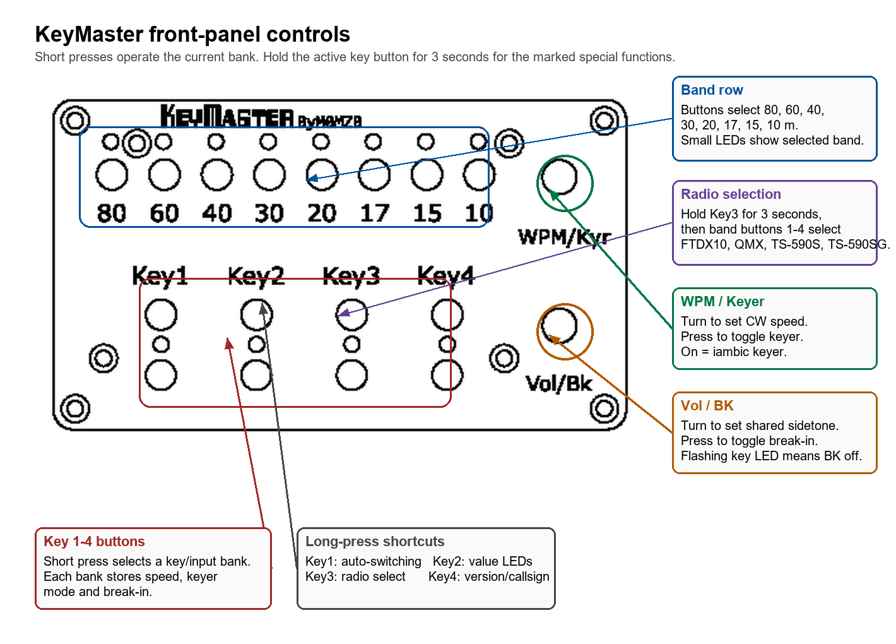
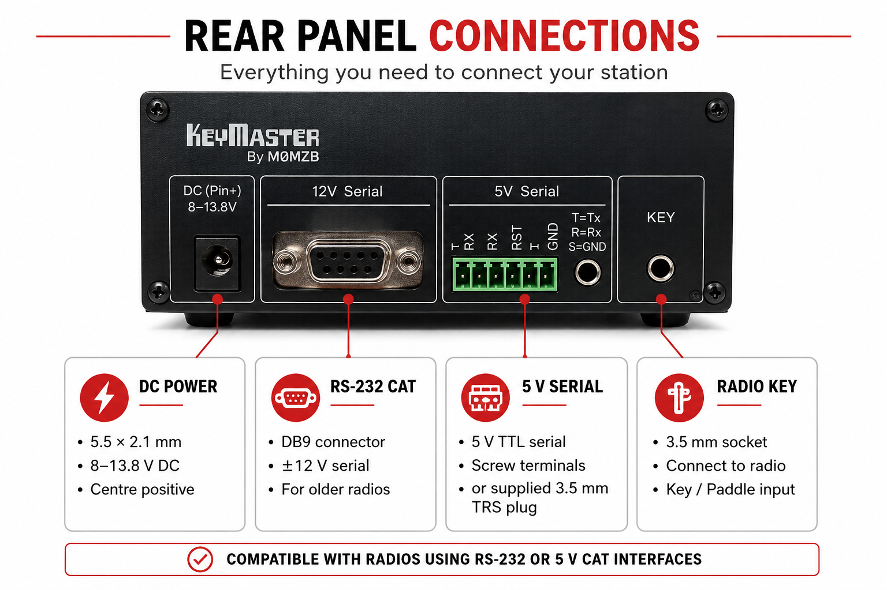

# KeyMaster


KeyMaster is a front-panel controller for sharing one radio between four CW key inputs. Each key input has its own saved operating bank, so changing from one key to another can also change CW speed, keyer mode, break-in mode, and band. Sidetone/monitor volume is shared across all banks.

The unit can run standalone with no radio connected. When a supported radio is connected by CAT, KeyMaster sends the front-panel changes to the radio and reads back the status values that the selected radio driver supports.

KeyMaster is designed and produced by M0MZB. This GitHub repository hold the publicly available instructions and related information. The firmware and schematics are ina limited available repository. To purchase a KeyMaster send M0MZB and email, details avaialable on QRZ.

Firmware version: `02`

## Front Panel



## Rear Panel



## Quick Start

1. Power the KeyMaster and radio.
2. Select the required radio type if this is the first use with that radio.
3. Press `Key1`, `Key2`, `Key3`, or `Key4` to choose the active key/input bank.
4. Press a band button to select `80`, `60`, `40`, `30`, `20`, `17`, `15`, or `10` metres.
5. Turn `WPM/Kyr` to set CW speed.
6. Press `WPM/Kyr` to toggle the internal radio keyer mode.
7. Turn `Vol/Bk` to set sidetone/monitor volume.
8. Press `Vol/Bk` to toggle break-in.

Settings are saved automatically, but not instantly. Leave the unit powered for at least 30 seconds after changing settings if you want to be certain the latest changes have been written.

## What Each Bank Stores

Each of the four key/input banks stores:

| Setting | Meaning |
| --- | --- |
| CW speed | The WPM value sent to the radio |
| Keyer mode | Keyer on means iambic/electronic keyer; keyer off means straight-key style operation where supported |
| Break-in | Whether the radio transmits automatically while keying |

Monitor volume is stored once for the whole unit, not separately for each bank. When you select a different key bank, KeyMaster disconnects the key line briefly, applies the shared monitor volume plus the selected bank settings over CAT where possible, then reconnects the selected key input. If no radio is connected, the bank still changes locally.

## Normal Controls

### Key Buttons

| Action | Result |
| --- | --- |
| Short press `Key1` to `Key4` | Select that key/input bank |
| Hold the currently selected `Key1` for 3 seconds | Toggle automatic key-based input switching |
| Hold the currently selected `Key2` for 3 seconds | Toggle encoder-value display on the LEDs |
| Hold the currently selected `Key3` for 3 seconds | Enter or leave radio-selection mode |
| Hold the currently selected `Key4` for 3 seconds | Display firmware version, then send callsign `M0MZB` on the LEDs in Morse |

The active key LED blinks after about one second of holding as a warning that the three-second action is about to trigger.

### Band Buttons

The eight band buttons select:

```text
80  60  40  30  20  17  15  10
```

The small LEDs above the band row show the selected band. Some temporary displays reuse the band LEDs for short animations, then return to the selected band display.

### Encoder Direction Settings

The direction of each encoder can be reversed independently to suit the encoders fitted to a particular unit:

| Encoder | How to reverse its direction |
| --- | --- |
| `WPM/Kyr` | Hold its push-button while powering on |
| `Vol/Bk` | Hold its push-button while powering on |

Keep the button held throughout the startup LED chase. When the confirmation LEDs appear, release it. The outermost key/band LEDs mean that the selected encoder is now reversed; the innermost LEDs mean normal direction. Repeat the same procedure to toggle it back. Each direction setting is saved immediately and remains in effect after power-off.

### WPM/Kyr Control

| Action | Result |
| --- | --- |
| Turn `WPM/Kyr` | Change CW speed for the active bank |
| Press `WPM/Kyr` | Toggle keyer mode for the active bank |
| Hold `WPM/Kyr` while powering on | Reverse the WPM encoder direction for this unit |

When encoder-value display is enabled, changing WPM briefly shows the value on the LEDs before the display returns to normal.

To correct a unit whose WPM direction is reversed, hold `WPM/Kyr` throughout the startup LED chase. Keep holding until the confirmation LEDs appear, then release. The outermost key/band LEDs indicate reversed direction; the innermost LEDs indicate normal direction. The choice is saved immediately and does not alter bank or radio settings.

Keyer feedback on the band LEDs:

| Keyer state | LED feedback |
| --- | --- |
| On | Outer three LEDs on each side illuminate briefly |
| Off | Four centre LEDs illuminate briefly |

### Vol/Bk Control

| Action | Result |
| --- | --- |
| Turn `Vol/Bk` | Change the shared monitor/sidetone volume |
| Press `Vol/Bk` | Toggle break-in for the active bank |
| Hold `Vol/Bk` while powering on | Reverse the volume encoder direction for this unit |

When encoder-value display is enabled, changing volume briefly shows the value on the LEDs before the display returns to normal.

The volume direction is configured in the same way as WPM: hold `Vol/Bk` throughout the startup LED chase, wait for the confirmation LEDs, then release. WPM and volume directions are saved independently.

Break-in feedback:

| Break-in state | LED feedback |
| --- | --- |
| On | Band LEDs fan out from the centre |
| Off | Band LEDs collapse back towards the centre |

When break-in is off, the active key LED flashes with a short off period. When break-in is on, the active key LED stays solid.

## Selecting The Radio Type And CAT Baud Rate

1. Short press `Key3` so bank 3 is the active bank.
2. Hold `Key3` for 3 seconds to enter radio-selection mode.
3. All band and key LEDs illuminate. The current radio and baud-rate LEDs flash.
4. Press a band button to select the radio and a key button to select the baud rate.
5. Hold `Key3` again for 3 seconds to leave radio-selection mode. A short Key3 press selects 19200 baud.

| Band button | Radio driver |
| ---: | --- |
| `80` / button 1 | Yaesu FTDX10 (also used for the FT-991A) |
| `60` / button 2 | QRP Labs QMX |
| `40` / button 3 | Kenwood TS-590S |
| `30` / button 4 | Kenwood TS-590SG |
| `20` / button 5 | Yaesu FT-710 |
| `17` / button 6 | Kenwood TS-890S |

| Key button | CAT baud rate |
| ---: | ---: |
| `Key1` | 4800 |
| `Key2` | 9600 |
| `Key3` | 19200 |
| `Key4` | 38400 |

Set this rate to the same CAT baud rate configured in the radio. It can be changed independently of the selected radio driver. The radio choice is saved on the next scheduled settings write; the baud choice is saved immediately and remains in effect after power-off. On an upgrade with no saved baud choice, Yaesu radios default to 38400 and the other current drivers default to 9600.

## Supported Radios

| Radio | Default CAT rate | Implemented status/control |
| --- | ---: | --- |
| Yaesu FTDX10 | 38400 baud | Band, CW speed, keyer, monitor volume, break-in |
| Yaesu FT-991A using the FTDX10 driver | 38400 baud | Band, CW speed, keyer, monitor volume, break-in |
| Yaesu FT-710 | 38400 baud | Band, CW speed, keyer, monitor volume, break-in |
| QRP Labs QMX | 9600 baud | Band and CW speed status; band, CW speed, keyer, monitor volume, and practice/break-in control |
| Kenwood TS-590S | 9600 baud | Band, CW speed, keyer, and monitor status; band, CW speed, keyer, monitor, and break-in control |
| Kenwood TS-590SG | 9600 baud | Band, CW speed, keyer, and monitor status; band, CW speed, keyer, monitor, and break-in control |
| Kenwood TS-890S | 9600 baud | Band, CW speed, keyer, monitor, and break-in status/control |

FT818 and IC7300 identifiers exist in the source but do not yet have drivers. Selecting an unsupported type falls back to the FTDX10 driver.

The FT-991A does not have a separately named driver in the radio-selection menu. It is supported through the compatible FTDX10 driver: select the `80` band button when choosing the radio type.

### Radio Setup And CAT Cabling

Always switch off both the radio and KeyMaster before connecting or disconnecting a CAT cable. Select the correct radio driver on KeyMaster and set its CAT baud rate to match the radio.

#### Yaesu FTDX10

On the FTDX10 perform the following menu selections:

- **Operation Setting -> General -> 232C RATE:** `38400` - and configure KeyMaster to the same rate.
- Power down the radio and KeyMaster, then connect KeyMaster's `12V SERIAL` DB9 connector to the radio's rear `RS-232C` connector using a straight-through DB9 cable. Do not use a null-modem cable.

Be sure to change `232C RATE`, not `CAT RATE`; `CAT RATE` controls the USB CAT connection. The FTDX10 connection uses 8 data bits, no parity, and 2 stop bits.

#### Yaesu FT-991A

When using an FT-991A, select the **Yaesu FTDX10** radio option on KeyMaster. In radio-selection mode this is the `80` band button.

On the FT-991A perform the following menu selections:

- **Menu 028:** `RS232C`
- **Menu 029:** `38400` - and configure KeyMaster to the same rate.
- Power down the radio and KeyMaster, then connect KeyMaster's `12V SERIAL` DB9 connector to the FT-991A's rear `GPS/CAT` DB9 connector using a straight-through cable. Do not use a null-modem cable.
- Power-cycle the radio after changing the serial configuration.

Menu 031 sets the CAT rate for the USB connection, so be sure to use Menu 029 for the rear `GPS/CAT` connector used by KeyMaster.

#### Yaesu FT-710

On the FT-710 perform the following menu selections:

- **Operation Setting -> General -> TUN/LIN PORT SELECT:** `CAT-3`
- **Operation Setting -> General -> CAT-3 RATE:** `38400` - and configure KeyMaster to the same rate.
- **Operation Setting -> General -> CAT-1 CAT-3 STOP BIT:** `1 bit`
- Power down the radio and KeyMaster, then connect KeyMaster's `5V SERIAL` connector to the radio's rear `TUNER/LINEAR` mini-DIN connector using an appropriate KeyMaster-to-FT-710 cable.

The `TUNER/LINEAR` connector provides 5V TTL serial, not RS-232 voltage levels. Do not connect it to KeyMaster's DB9 `12V SERIAL` connector. Selecting `CAT-3` means that this radio connector cannot simultaneously operate an external antenna tuner or linear amplifier.

#### QRP Labs QMX

On a QMX running recent firmware perform the following menu selections:

- **System Config -> Serial 1 on AUX:** `ENABLED`
- **System Config -> Serial 1 baud:** `9600` - and configure KeyMaster to the same rate.
- Power down the QMX and KeyMaster, then connect KeyMaster's `5V SERIAL` connector to the QMX `AUX` socket using a suitable stereo 3.5 mm cable.

Wire the cable so that the QMX tip (QMX transmit) connects to KeyMaster receive, the QMX ring (QMX receive) connects to KeyMaster transmit, and the sleeves provide the common ground. This is a logic-level serial connection; do not connect it to KeyMaster's DB9 `12V SERIAL` connector. If `Serial 1 on AUX` is absent, install a newer QMX firmware version that provides the AUX serial-port option.

#### Kenwood TS-590S

On the TS-590S perform the following menu selection:

- **Menu 61 - COM port baud rate:** `9600` - and configure KeyMaster to the same rate.
- Power down the radio and KeyMaster, then connect KeyMaster's `12V SERIAL` DB9 connector to the radio's rear `COM` connector using a straight-through DB9 cable. Do not use a null-modem cable.
- Power-cycle the radio after changing the COM-port rate.

The connection uses 8 data bits, no parity, and 1 stop bit. KeyMaster does not use RTS/CTS hardware flow control. Use Menu 61, not Menu 62, which controls the USB connection. Operate the radio in CW or CW-R mode: Kenwood defines `VX` as break-in control only in a CW mode and as voice VOX control in other modes.

#### Kenwood TS-590SG

On the TS-590SG perform the following menu selection:

- **Menu 67 - COM port baud rate:** `9600` - and configure KeyMaster to the same rate.
- Power down the radio and KeyMaster, then connect KeyMaster's `12V SERIAL` DB9 connector to the radio's rear `COM` connector using a straight-through DB9 cable. Do not use a null-modem cable.
- Power-cycle the radio after changing the COM-port rate.

The connection uses 8 data bits, no parity, and 1 stop bit. KeyMaster does not use RTS/CTS hardware flow control. Use Menu 67, not Menu 68, which controls the USB connection. Operate the radio in CW or CW-R mode: Kenwood defines `VX` as break-in control only in a CW mode and as voice VOX control in other modes.

For both TS-590 models, the normal band buttons recall the radio's own band-stack entry. Because Kenwood has no 60 m `BD` band number, KeyMaster loads 5.357 MHz into VFO A and selects VFO A when the 60 m button is pressed.

#### Kenwood TS-890S

On the TS-890S perform the following menu selection:

- **Menu 7-00 - Baud Rate (COM Port):** `9600` - and configure KeyMaster to the same rate.
- Power down the radio and KeyMaster, then connect KeyMaster's `12V SERIAL` DB9 connector to the radio's rear `COM` connector using a straight-through DB9 cable. Do not use a null-modem cable.

The connection uses 8 data bits, no parity, and 1 stop bit. KeyMaster does not use RTS/CTS hardware flow control. Use Menu 7-00, not Menu 7-01 or 7-02, which configure the USB virtual COM ports.

### TS-590S/TS-590SG Straight-Key And Bug Wiring

The TS-590S and TS-590SG have separate rear-panel inputs: `KEY` is intended for a straight key or external keyer, while `PADDLE` feeds the radio's internal electronic keyer. KeyMaster connects to the radio's `PADDLE` socket so it can route ordinary iambic paddles as well as straight keys and bugs. The KeyMaster-to-radio cable must therefore be a normal, fully wired TRS paddle cable.

The TS-590 CAT command set cannot change the `PADDLE` socket into a true straight-key input. KeyMaster works around this radio limitation by using the TS-590 Bug key function. Keyer on disables Bug mode and gives normal electronic/iambic operation. Keyer off enables Bug mode: dit still generates automatic dots, while dah becomes manually timed and can behave like a straight-key input.

The important isolation is at the individual straight-key or bug connection **into KeyMaster**. It is not in the cable from KeyMaster to the radio:

```text
STRAIGHT KEY OR MECHANICAL BUG -> KEYMASTER INPUT

  Key or bug contact
       o/ o
       |  |
       |  +-------------------------------- SLEEVE (common/GND)
       |
       +----------------------------------- RING (DAH / dash)

  TIP (DIT / dot) ------------------------- NO CONNECTION
                                             Leave isolated/floating


KEYMASTER OUTPUT -> TS-590 PADDLE

  KeyMaster TIP    (DIT) ------------------ TS-590 TIP    (DIT)
  KeyMaster RING   (DAH) ------------------ TS-590 RING   (DAH)
  KeyMaster SLEEVE (common) --------------- TS-590 SLEEVE (common)

  This is a normal, fully wired TRS-to-TRS paddle cable.
```

Use a stereo TRS plug at the KeyMaster end of every straight-key or mechanical-bug lead. Connect the key switch only between ring (dah) and sleeve (common), and leave that plug's tip (dit) terminal completely unwired. The dit conductor must be isolated at this **KeyMaster input plug**. Do not remove or isolate dit in the KeyMaster-to-radio cable.

An ordinary paddle connects to a KeyMaster input normally, with dit, dah, and common all wired. KeyMaster routes both paddle contacts through its multiplexer and the fully wired output cable to the TS-590 `PADDLE` socket. This is why the output cable must retain its tip/dit connection.

```text
                         Selected KeyMaster input
                                  |
        +-------------------------+-------------------------+
        |                                                   |
 Straight key or bug                                  Iambic paddle
 ring + sleeve only                                tip + ring + sleeve
 tip floating                                              all wired
        |                                                   |
        +-------------------------+-------------------------+
                                  |
                         KeyMaster multiplexer
                                  |
                     normal fully wired TRS cable
                        tip + ring + sleeve
                                  |
                                  v
                         TS-590 PADDLE socket
                                  |
                 +----------------+----------------+
                 |                                 |
       Keyer OFF / Bug ON                 Keyer ON / Bug OFF
       dah manually timed                normal iambic keyer
```

Do not use a mono TS plug for a straight key or bug at a KeyMaster input. Depending on the socket construction, it can short a paddle contact to common. Do not join tip and ring together: in Bug mode, grounding tip asks the radio's internal keyer to generate automatic dots.

This arrangement deliberately uses the TS-590 `PADDLE` socket rather than its separate `KEY` socket, allowing KeyMaster to select either a fully wired paddle or a dah-only straight key/bug without moving the radio plug. It remains an emulation imposed by the TS-590 hardware: keyer-off mode is technically Bug mode, not a true straight-key input mode, and CW message memory is unavailable while Bug mode is enabled.

The diagrams assume the radio's dot/dash reversal setting is OFF: tip is dit and ring is dah. If reversal is enabled, those physical roles exchange, so disable reversal when using this wiring.

## LED Messages

| Display | Meaning |
| --- | --- |
| One key LED solid | Active key/input bank |
| Active key LED flashing | Break-in is off for the active bank |
| One band LED solid | Active band |
| All band LEDs on, one flashing | Radio-selection mode |
| Band LEDs show a temporary bar graph | Encoder-value display for WPM or volume |
| Every other band LED and every key LED lit briefly | CAT command queue overflow warning |
| Key LEDs flashing during a button hold | Long-press warning |

The overflow warning means the firmware could not queue a CAT command at that moment. The unit continues running; if the radio is disconnected or not responding, KeyMaster should still operate as a standalone key/input controller.

## Default Settings

On blank or invalid EEPROM, KeyMaster starts on input 1 with automatic key switching enabled, encoder-value display disabled, shared monitor volume `10`, and the FTDX10 driver selected.

| Bank | CW speed | Keyer | Break-in |
| ---: | ---: | --- | --- |
| 1 | 25 | On | Off |
| 2 | 35 | On | Off |
| 3 | 25 | Off | Off |
| 4 | 35 | Off | Off |

## Troubleshooting

| Symptom | Things to check |
| --- | --- |
| Radio does not respond to controls | Confirm the selected radio type, CAT cable, radio CAT baud rate, and that the radio is powered |
| An encoder changes values in the wrong direction | Hold that encoder's push-button while powering on to reverse its saved direction |
| KeyMaster works until the radio is unplugged | This should not happen in current firmware; if it does, note the LED pattern and selected radio type |
| Active key LED keeps flashing | Break-in is off for that bank; press `Vol/Bk` to toggle it |
| The wrong key bank is selected when keying | Check whether automatic key-based input switching is enabled |
| A long press does nothing | Make sure you are holding the currently selected key button, not an inactive bank button |
| Latest setting was lost after power-off | Leave the unit powered for 30 seconds after changing settings |
| Uploading firmware fails | Disconnect or isolate the radio CAT interface while programming |

## Build And Upload

These notes are for firmware maintenance rather than day-to-day operation.

1. Open `_KeyMaster.ino` in Arduino IDE.
2. Select the board/core matching the ATmega328P hardware and the correct serial port.
3. Compile and upload.

The project uses only Arduino AVR core facilities and its bundled `EEPROM` library; there are no third-party library dependencies. The CAT port is the hardware `Serial` port, so radio CAT hardware can interfere with programming if it is connected during upload.

## Generate Code Documentation

The source includes Doxygen comments and a `Doxyfile`. To generate HTML documentation, install Doxygen and run:

```text
doxygen Doxyfile
```

The generated site is written to `docs/doxygen/html/index.html`. The generated output is not intended to be committed to the repository.

On GitHub, the `Doxygen Pages` workflow builds the same documentation and publishes it with GitHub Pages. If Pages is enabled for this repository using the GitHub Actions source, the hosted documentation will appear at:

```text
https://mad-bee.github.io/keyMaster/
```

## Hardware Pin Map

| Function | Arduino pin |
| --- | --- |
| Input-button resistor ladder | A0 |
| Band-button resistor ladder | A2 |
| Encoder push-button ladder | A4 |
| Multiplexer address A0 / A1 | D5 / D6 |
| Multiplexer enable | A5, LOW means connected |
| Shift-register data / clock / latch | D7 / D4 / A1 |
| Monitor encoder A / B | D3 / D2 |
| CW-speed encoder A / B | D8 / D9 |
| Key sense 1-4 | D13 / D12 / D11 / D10 |
| Radio CAT | Hardware `Serial` |

ADC thresholds are tied to the resistor values used by the control board. See [docs/ARCHITECTURE.md](docs/ARCHITECTURE.md) for thresholds, data flow, persistence, and driver details.

## Source Layout

| File | Purpose |
| --- | --- |
| `_KeyMaster.ino` | Hardware setup, user interface, bank switching, LEDs, EEPROM, and scheduler |
| `Radio.h/.cpp` | Common radio interface and status-change tracking |
| `FTDX10Radio.h/.cpp` | Yaesu CAT driver |
| `FT710Radio.h/.cpp` | Yaesu FT-710 CAT driver |
| `QMXRadio.h/.cpp` | QMX CAT/menu driver |
| `TS590SRadio.h/.cpp` | Kenwood TS-590S CAT driver |
| `TS590SGRadio.h/.cpp` | Kenwood TS-590SG CAT driver |
| `TS890SRadio.h/.cpp` | Kenwood TS-890S CAT driver |
